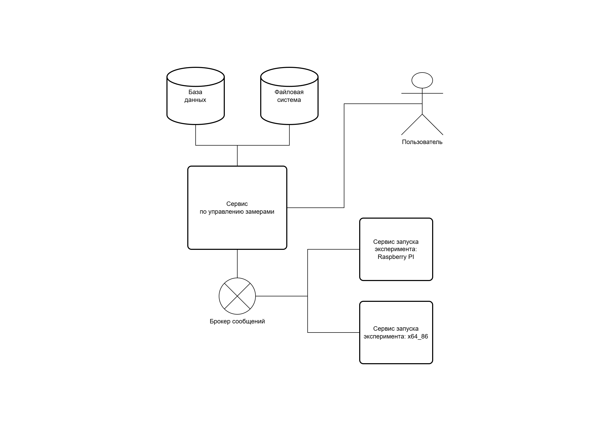

# WAPA

**WAPA** - (WebAssembly Performance Analyzer) программная платформа для автоматизированного сравнения производительности JavaScript и модулей WebAssembly, скомпилированных с использованием различных языков программирования (Go, C++, Rust) на разных аппаратных архитектурах.

## О проекте

Платформа предназначена для экспериментальных исследований производительности вычислительных WebAssembly-модулей. Система реализована в виде микросервисной архитектуры с использованием Go, фреймворка Echo для REST API и брокера сообщений NATS для обмена заданиями между сервисами.

**Цели платформы:**
- Автоматизированный запуск и сравнение вычислительных модулей для задач на JavaScript и WebAssembly.
- Поддержка модулей, скомпилированных из Go, Rust, C++.
- Сравнение производительности на аппаратных платформах amd64 и arm64 (например, Raspberry Pi).
- Хранение данных и агрегация метрик результатов тестирования.

## Запуск

Сборка и развертывание сервисов осуществляется через `docker-compose`.

## Планы по улучшению проекта

Проект WAPA был реализован как часть выпускной квалификационной работы.
С того времени реализация проекта сильно устарела, у нее есть множество проблем.
Сама идея проекта мне нравится, он может быть хорошим pet-проектом.
Однако стоит его переписать, чтобы он лучше соответствовал моим профессиональным целям.

Вот что мне хотелось бы изменить:

1. Вместо postgres использовать Elasticsearch для хранения информации об экспериментах.
2. NATS заменить на Kafka.
3. Переписать проект и изменить его структуру, чтобы соответствовать типичным паттернам корпоративной разработки.
4. Добавить в качестве исполнителя также и браузер (предложение с защиты).
